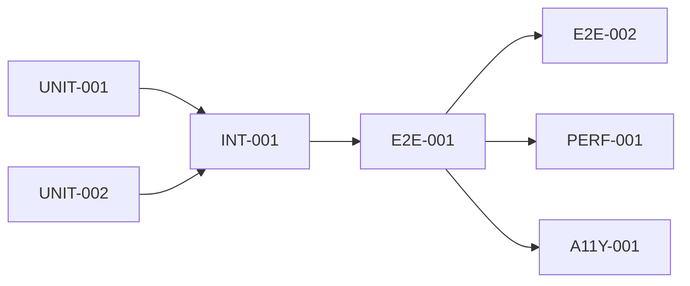

# Test Issues Checklist: Frontend Template

This document provides a comprehensive checklist of test issues for GitHub project management, following ISTQB and ISO 25010 frameworks.

---

## Test Level Issues Creation

### Test Strategy Issue

- [x] **TEST-STRATEGY-001**: Overall testing approach and quality validation plan
  - Labels: `test-strategy`, `istqb`, `iso25010`, `quality-gates`
  - Estimate: 2 story points
  - Status: Created (see `test-strategy.md`)

### Unit Test Issues

| Issue ID | Component | Description | Priority | Estimate | Dependencies |
|----------|-----------|-------------|----------|----------|--------------|
| UNIT-001 | `useAuth` hook | Complete edge case coverage (token failures, backend errors) | Critical | 2 SP | None |
| UNIT-002 | `apiRequest` utility | All HTTP status codes, network errors, retry logic | Critical | 2 SP | None |
| UNIT-003 | `getAccessToken` utility | Token acquisition, popup fallback, error handling | High | 1 SP | UNIT-001 |
| UNIT-004 | `authenticateWithBackend` | Backend auth responses, JSON parsing errors | High | 1 SP | UNIT-001 |
| UNIT-005 | `getUserProfile` wrapper | Profile fetch success/error paths | Medium | 0.5 SP | UNIT-002 |
| UNIT-006 | `checkHealth` wrapper | Health check success/error paths | Low | 0.5 SP | UNIT-002 |

### Integration Test Issues

| Issue ID | Component | Description | Priority | Estimate | Dependencies |
|----------|-----------|-------------|----------|----------|--------------|
| INT-001 | App routing | Route × auth state decision table validation | Critical | 2 SP | UNIT-001 |
| INT-002 | Protected routes | Redirect behavior for unauthenticated users | Critical | 1 SP | INT-001 |
| INT-003 | Auth state transitions | Loading → authenticated → error flows | High | 2 SP | INT-001 |
| INT-004 | Component rendering | Page components with different auth states | High | 1 SP | INT-001 |

### End-to-End Test Issues (Playwright)

| Issue ID | User Flow | Description | Priority | Estimate | Dependencies |
|----------|-----------|-------------|----------|----------|--------------|
| E2E-001 | Landing page | Complete landing page display and navigation | Critical | 2 SP | None |
| E2E-002 | Login navigation | Navigate to login via Get Started / Sign In | Critical | 1 SP | E2E-001 |
| E2E-003 | Features scroll | Learn More button scrolls to features section | High | 1 SP | E2E-001 |
| E2E-004 | Login page elements | Login button display and accessibility | High | 1 SP | E2E-002 |
| E2E-005 | Keyboard navigation | Tab order and focus management | High | 1 SP | E2E-004 |
| E2E-006 | Responsive design | Mobile/tablet/desktop viewport validation | High | 2 SP | E2E-001 |
| E2E-007 | Cross-browser | Firefox, WebKit compatibility | Medium | 2 SP | E2E-001 |

### Performance Test Issues

| Issue ID | Metric | Description | Threshold | Priority | Estimate |
|----------|--------|-------------|-----------|----------|----------|
| PERF-001 | LCP | Largest Contentful Paint | < 2.5s | High | 2 SP |
| PERF-002 | FID | First Input Delay | < 100ms | High | 1 SP |
| PERF-003 | CLS | Cumulative Layout Shift | < 0.1 | High | 1 SP |
| PERF-004 | Bundle size | Main bundle < 200KB gzipped | < 200KB | Medium | 1 SP |

### Security Test Issues

| Issue ID | Area | Description | Priority | Estimate | Dependencies |
|----------|------|-------------|----------|----------|--------------|
| SEC-001 | Secret scanning | No secrets in codebase | Critical | 1 SP | None |
| SEC-002 | Dependency audit | No critical vulnerabilities | Critical | 1 SP | None |
| SEC-003 | Auth token handling | Secure token storage and transmission | Critical | 2 SP | UNIT-001 |
| SEC-004 | Protected routes | No unauthorized access to /welcome | High | 1 SP | INT-002 |
| SEC-005 | HTTPS enforcement | All API calls use HTTPS | High | 0.5 SP | E2E-001 |

### Accessibility Test Issues

| Issue ID | Standard | Description | Priority | Estimate |
|----------|----------|-------------|----------|----------|
| A11Y-001 | WCAG 2.1 AA | Color contrast validation | High | 1 SP |
| A11Y-002 | WCAG 2.1 AA | Keyboard navigation complete | High | 1 SP |
| A11Y-003 | WCAG 2.1 AA | Screen reader compatibility | High | 2 SP |
| A11Y-004 | WCAG 2.1 AA | Focus management on route changes | Medium | 1 SP |
| A11Y-005 | WCAG 2.1 AA | Form labels and error messages | Medium | 1 SP |

### Regression Test Issues

| Issue ID | Trigger | Description | Priority | Estimate |
|----------|---------|-------------|----------|----------|
| REG-001 | Every PR | Run full unit test suite | Critical | Auto |
| REG-002 | Every PR | Run Chromium E2E tests | Critical | Auto |
| REG-003 | Main merge | Run full multi-browser E2E | High | Auto |
| REG-004 | Dependency update | Run security + full test suite | High | Auto |

---

## Test Types Identification and Prioritization

### Functional Testing Priority

- [x] **Critical**: Authentication flow (login, logout, token refresh)
- [x] **Critical**: Route protection and redirects
- [x] **Critical**: API request/response handling
- [ ] **High**: User profile display
- [ ] **High**: Navigation between pages
- [ ] **Medium**: Learn More scroll behavior
- [ ] **Low**: Footer content display

### Non-Functional Testing Priority

- [ ] **Critical**: Security (secret scanning, auth validation)
- [ ] **High**: Performance (Core Web Vitals)
- [ ] **High**: Accessibility (WCAG 2.1 AA)
- [ ] **High**: Cross-browser compatibility
- [ ] **Medium**: Responsive design
- [ ] **Low**: SEO validation

### Structural Testing Priority

- [x] **Critical**: > 80% line coverage for `useAuth.ts`
- [x] **Critical**: > 80% line coverage for `api.ts`
- [ ] **High**: > 80% line coverage for page components
- [ ] **Medium**: > 80% branch coverage overall
- [ ] **Low**: 100% coverage for utility functions

### Change-Related Testing Priority

- [x] **Critical**: Unit tests on every commit (pre-commit hook)
- [x] **Critical**: Full test suite on every PR
- [ ] **High**: E2E on main branch merges
- [ ] **Medium**: Performance regression on weekly schedule

---

## Test Dependencies Documentation

### Implementation Dependencies

| Test Issue | Blocked By | Reason |
|------------|------------|--------|
| INT-001 | UNIT-001 | Routing tests depend on useAuth mock patterns |
| E2E-002 | E2E-001 | Login navigation requires landing page ready |
| PERF-001 | E2E-001 | Performance metrics collected via E2E |
| A11Y-003 | E2E-001 | Screen reader tests use Playwright |

### Environment Dependencies

| Test Type | Environment Requirement |
|-----------|------------------------|
| Unit tests | Node.js 22, jsdom |
| Integration tests | Node.js 22, jsdom, React Testing Library |
| E2E tests | Playwright browsers (Chromium, Firefox, WebKit) |
| Performance tests | Lighthouse CI, stable network |
| Accessibility tests | axe-core, Playwright |

### Tool Dependencies

| Tool | Purpose | Setup Required |
|------|---------|----------------|
| Vitest | Unit/integration test runner | `npm install` |
| Playwright | E2E browser automation | `npx playwright install` |
| axe-core | Accessibility testing | Installed via `@axe-core/playwright` |
| Lighthouse CI | Performance testing | GitHub Action or local install |

### Cross-Team Dependencies

| Dependency | Team | Impact |
|------------|------|--------|
| MSAL configuration | Platform/Identity | Auth tests require valid tenant config |
| Backend API | Backend team | Integration tests mock API responses |
| Grafana Cloud | DevOps | Monitoring validation in production |

---

## Test Coverage Targets and Metrics

### Code Coverage Targets

| Metric | Current | Target | Gap |
|--------|---------|--------|-----|
| **Lines** | 70% | 80% | +10% |
| **Branches** | 60% | 80% | +20% |
| **Functions** | 70% | 80% | +10% |
| **Statements** | 60% | 80% | +20% |

### Coverage by Component

| Component | Current | Target | Priority |
|-----------|---------|--------|----------|
| `src/hooks/useAuth.ts` | ~85% | 95% | Critical |
| `src/utils/api.ts` | ~75% | 90% | Critical |
| `src/pages/LandingPage.tsx` | ~80% | 85% | High |
| `src/pages/LoginPage.tsx` | ~80% | 85% | High |
| `src/pages/WelcomePage.tsx` | ~80% | 85% | High |
| `src/App.tsx` | ~90% | 95% | Critical |

### Functional Coverage Targets

- [x] 100% of acceptance criteria have tests
- [x] 100% of user-facing routes tested
- [ ] 100% of error states handled and tested
- [ ] 100% of API response codes tested

### Risk Coverage Targets

- [x] 100% authentication failure paths tested
- [x] 100% network error paths tested
- [ ] 100% token expiration scenarios tested
- [ ] 100% concurrent request scenarios tested

---

## Task Level Breakdown

### Test Implementation Tasks

| Task ID | Description | Type | Estimate | Assignee |
|---------|-------------|------|----------|----------|
| TASK-001 | Add missing useAuth edge case tests | Unit | 1 SP | - |
| TASK-002 | Add apiRequest server error tests | Unit | 1 SP | - |
| TASK-003 | Add apiRequest validation error tests | Unit | 0.5 SP | - |
| TASK-004 | Add page component snapshot tests | Unit | 1 SP | - |
| TASK-005 | Add routing decision table tests | Integration | 2 SP | - |
| TASK-006 | Add E2E accessibility tests | E2E | 2 SP | - |
| TASK-007 | Add E2E responsive viewport tests | E2E | 1 SP | - |
| TASK-008 | Add Lighthouse CI workflow | Performance | 2 SP | - |

### Test Environment Setup Tasks

| Task ID | Description | Estimate | Status |
|---------|-------------|----------|--------|
| ENV-001 | Configure Vitest with V8 coverage | 0.5 SP | ✅ Done |
| ENV-002 | Configure Playwright multi-browser | 0.5 SP | ✅ Done |
| ENV-003 | Set up GitHub Actions quality workflow | 1 SP | ✅ Done |
| ENV-004 | Set up GitHub Actions E2E workflow | 1 SP | ✅ Done |
| ENV-005 | Add Lighthouse CI to quality workflow | 1 SP | TODO |
| ENV-006 | Add axe-core to Playwright config | 0.5 SP | TODO |

### Test Data Preparation Tasks

| Task ID | Description | Estimate | Status |
|---------|-------------|----------|--------|
| DATA-001 | Create mock user account fixtures | 0.5 SP | ✅ Done |
| DATA-002 | Create mock API response factories | 0.5 SP | ✅ Done |
| DATA-003 | Create mock MSAL authentication results | 0.5 SP | ✅ Done |
| DATA-004 | Create test user profiles for E2E | 0.5 SP | TODO |

---

## Task Dependencies and Sequencing

### Sequential Dependencies

### Parallel Development Opportunities

| Parallel Group | Tasks |
|----------------|-------|
| **Group A** | UNIT-001, UNIT-002, UNIT-003 |
| **Group B** | E2E-001, E2E-006, E2E-007 (after INT-001) |
| **Group C** | SEC-001, SEC-002 (independent) |
| **Group D** | A11Y-001, A11Y-002, A11Y-003 |

### Critical Path

1. UNIT-001 (useAuth) → 2. INT-001 (Routing) → 3. E2E-001 (Landing) → 4. PERF-001 (LCP) → 5. Release

---

## GitHub Issue Labels

### Test Type Labels

- `unit-test` - Component-level unit tests
- `integration-test` - Multi-component integration tests
- `e2e-test` - End-to-end Playwright tests
- `performance-test` - Lighthouse/Web Vitals tests
- `security-test` - Security validation tests
- `accessibility-test` - WCAG compliance tests

### Quality Labels

- `quality-gate` - Blocks release if failing
- `iso25010` - ISO 25010 quality characteristic
- `istqb-technique` - Uses specific ISTQB technique
- `risk-based` - Prioritized by risk assessment

### Priority Labels

- `test-critical` - Must pass for any release
- `test-high` - Should pass for production release
- `test-medium` - Nice to have coverage
- `test-low` - Future enhancement

### Component Labels

- `frontend-test` - React component tests
- `hook-test` - React hook tests
- `api-test` - API client tests
- `auth-test` - Authentication flow tests
- `routing-test` - Navigation/routing tests
